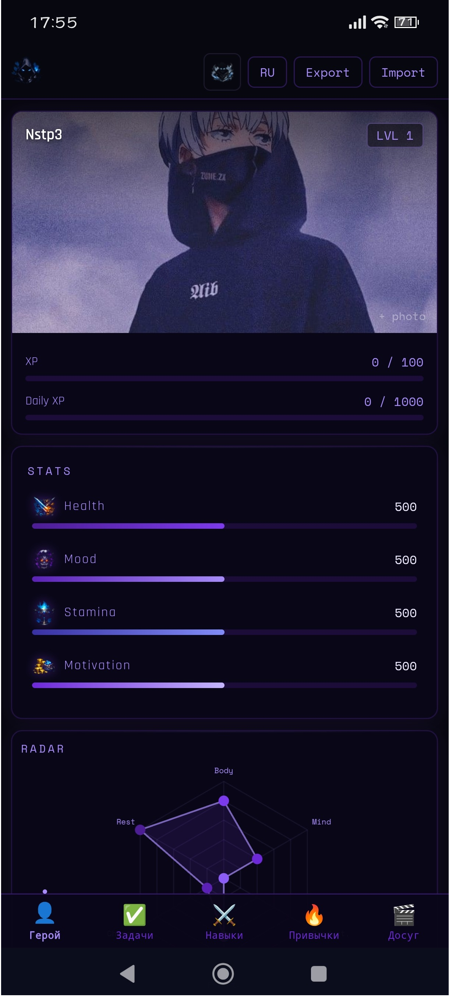

Razl — Plan Fast

  <table>
    <tr>
      <td align="center"> Десктоп — все три темы</td>
      <td align="center" width="30%"> Мобиле — Solo Leveling</td>
    </tr>
  </table>
<a href="README.md">🇬🇧 English</a>  ·  <strong>🇷🇺 Русский</strong>
   
<a href="https://nstp3.github.io/">🌐 Живая версия</a>  · 
<a href="android_version/app-release.apk">⬇️ Android APK</a>  · 
<a href="PRIVACY.md">🔒 Политика конфиденциальности</a>

 
Личный дашборд продуктивности в стиле RPG. Превращает повседневные задачи, привычки и навыки в игровую прокачку персонажа. Работает прямо в браузере — без установки, без сервера, без регистрации.

✨ Возможности

Герой — профиль с аватаром, уровнем, XP и значками кубка игр и награды фильмов
Статы — Здоровье, Настроение, Выносливость, Мотивация с прогресс-барами
Задачи — по категориям, повторяющиеся задачи, выполнение даёт XP
Навыки — прокачка по 6 направлениям с визуализацией прогресса
Радар — паутинка баланса навыков
Привычки — трекер в формате календаря с drag-выделением
Помодоро — точный таймер, состояние сохраняется после уведомлений
Активность — линейный график за 14 дней
3 темы — Стандартная · Assassin's Creed · Solo Leveling
Экспорт / Импорт — бэкап в razl-backup.json
Мультиязычность — RU / EN
Уведомления — помодоро + ежедневные напоминания (веб + Android)
Фильмы — список с постером, вкладкой «Посмотрел» и системой наград
Игры — библиотека с обложкой, ссылкой на источник и системой кубков

🗂️ Интерфейс
Десктоп
Двухколоночный макет. Привычки сворачиваются — кликни на строку или используй «развернуть все».
Мобильная версия (нижняя навигация)
ВкладкаСодержимое👤 ГеройПрофиль · Статы · Радар✅ ЗадачиЗадачи · График активности⚔️ НавыкиНавыки · Календарь🔥 ПривычкиПомодоро · Привычки🎬 ДосугЛокальный плеер · Фильмы · Игры

✅ Задачи — Повторяющиеся
Создать повторяющуюся задачу
Выбери ♻️ Повтор в выпадающем списке категорий.
Управление
ДействиеКакУбрать повторНажми 🔄 у задачиПереключить повтор (мобиле)Зажми задачу ~0.6с → вибрация

🎮 Игры — Система кубков
ПройденоКубокСледующая цель0–9—1010+🥉 Бронза5050+🥈 Серебро100100+🥇 Золото250250+💎 Платина500500+💜 Фиолетовый10001000+👑 ЛегендарныйMAX
Кубок отображается рядом с именем персонажа. Каждый новый заменяет предыдущий.

🎬 Фильмы — Система наград
ПросмотреноНаградаСледующая цель0–9—1010+🥉 Бронзовая катушка2525+🥈 Серебряная катушка5050+🥇 Золотая катушка100100+🏅 Платиновая катушка250250+💚 Зелёная катушка500500+🔴 Красная катушка750750+💜 Фиолетовая катушка10001000+💠 Алмазная катушкаMAX
Награда фильмов отображается рядом с именем персонажа, рядом с кубком игр.

📱 Android APK
Работает офлайн — все файлы встроены.
Скачать
⬇️ Скачать app-release.apk
Установка

Скачай app-release.apk
Открой на телефоне
Если появится предупреждение → Настройки → Безопасность → Разрешить установку из неизвестных источников
Нажми Установить

⚠️ APK собран вручную, не проходил проверку Google Play — для личного использования нормально.

📱 Добавить на рабочий стол (без APK)
Android — Brave / Chrome
⋮ → «Добавить на главный экран» → Подтвердить
iPhone — Safari
Поделиться → «На экран "Домой"» → Подтвердить

🔔 Уведомления
Веб

Нажми «🔔 Нажми чтобы включить уведомления» под Помодоро
Помодоро: оповещение при окончании сессии/перерыва — работает на другой вкладке
Каждый день в 20:00: напоминания о задачах и привычках

Android APK

Помодоро: AlarmManager — срабатывает даже когда приложение закрыто
Каждый день в 20:00: WorkManager — срабатывает даже когда приложение закрыто
Нажатие на уведомление открывает приложение без сброса таймера

⏱ Помодоро
КнопкаДействиеСтартНачать рабочую сессиюПаузаЗаморозить оставшееся времяСтарт (после паузы)ПродолжитьСбросВернуться к полной длительностиПрименитьСохранить настройки и сбросить
Состояние таймера сохраняется — возврат из уведомления или фона не сбрасывает счётчик.

💾 Данные и конфиденциальность
Все данные хранятся локально на устройстве в IndexedDB. Ничего не передаётся на серверы. Подробнее: Политика конфиденциальности.

Экспорт → сохранит razl-backup.json
Импорт → выбери сохранённый файл

🎨 Темы оформления
ТемаСтильСтандартнаяТёмно-синяя — #2e4369 · #455bb2 · #cdd3fdAssassin's CreedПергамент, тёплые коричневые тонаSolo LevelingТёмно-фиолетовая, неоновые акценты

🚀 Локальный запуск
bashnpm install
npm run dev        # → http://localhost:5173
npm run build      # GitHub Pages → dist/
BUILD_TARGET=android npm run build   # Android → dist-android/
Быстрая пересборка APK
bashBUILD_TARGET=android npm run build && \
rm -r ~/AndroidStudioProjects/Nstp3RPG/app/src/main/assets/* && \
cp -r dist-android/* ~/AndroidStudioProjects/Nstp3RPG/app/src/main/assets

🛠️ Стек
СборщикVite 5ЯзыкVanilla JS (ES Modules)ДанныеIndexedDBГрафикиChart.jsХостингGitHub PagesAndroidWebView APK (Kotlin), офлайнУведомленияWeb Notifications API + AlarmManager + WorkManager

Plan fast. Прокачивай себя как персонажа. ⚔️